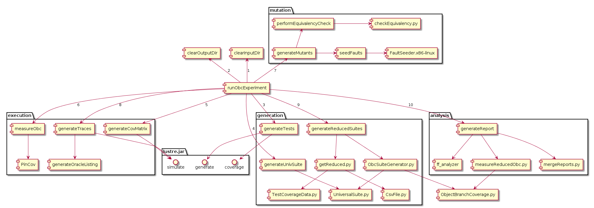
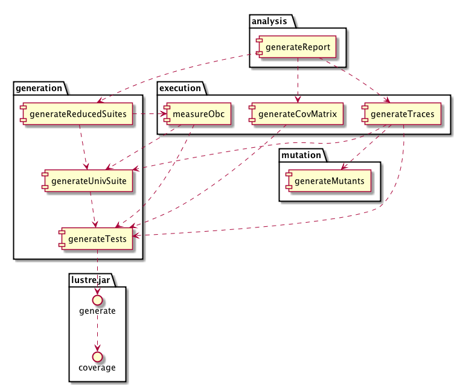

Coverage Measurement Toolchain
==============================

> written by Taejoon Byun <taejoon@umn.edu>
>
> first: Feb 9 2017  
> last : Mar 14 2017

Requirement
-----------

-   `jq`
-   `smlnj`
-   `python2`
    -   `IPython`
    -   `numpy`
    -   `pandas`

Architecture
------------

**runObcExperiment** is the top level script that runs an OBC fault-finding 
experiment. It is architectured as a pipeline that starts from the original 
source code, does various processing in sequence, and finally produces a 
fault-finding report of different coverage criteria. 

### Architecture Diagram

### Data Dependency

### Sequence of processing

1. `clearInputDir`
2. `clearOutputDir`
3. `generateTests`
4. `generateUnivSuite`
5. `generateCovMatrix`
6. `measureObc`
7. `generateMutants`
8. `generateTraces`
9. `generateReducedSuites`
10. `generateFaultFinding`

Directory Structure
-------------------

- `<sysroot>/`
    - `<sys>/`
        - `<base>.lus` (in)
        - `makefile` (in)
        - `<base>.flist` (in)
        - `<base>.c` (out)
        - `mutants/`
            - `{mutant}`
        - `equivalentMutants/`
            - `...`
        - `metadata/`
            - `...`
        - `obligations/`
        - `<base>.ff_oracles.csv`
        - `<base>.maximum_oracle.csv`
        - `<base>.output_oracle.csv`

- `<out>/`
    - `suites/<sysroot>/{sys}/`
        - `covMatrices/` # the test suites here are copied from the parent 
          directory
            - `<base>.{criterion}_tests.csv`
        - `reduced/` # The csv in this dir seems to list the ids of the test 
          cases in the reduced suites to keep (a minimal) while achieving the 
          same coverage
            - `<base>.{criterion}_tests_reduced.csv`
        - `separated/`
            - `<base>_tc_{n}.csv`
        - `<base>.{criterion}_tests.csv`
    - `traces/<sysroot>/{sys}/`
        - `<base>.{criterion}_tests.csv/`
            - `obligationCoverage/`
                - `<base>.{criterion}_obligations.lus_trace.csv`
            - `<base>.{mutant}_trace.csv`
            - `<base>.correct_trace.csv`
            - `<base>.<criterion>_tests.csv.mutants.csv` # mutant list
    - `results/<sysroot>/{sys}/`
        - `<base>.{criteria}_tests.csv.ff.csv`
    - `obc/<sysroot>/{sys}/`
        - `bin/`
            - `<base>.c`
            - `<base>.flist`
            - `makefile`
            - `{version}`
        - `cov/`
            - `{version}/`
                - `<basename>_universal.pincov`
                - `<basename>_tc_{i}.pincov`

